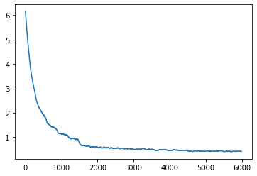
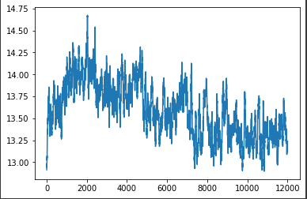

# Group Members
Riley Gamson (gamsoril), Eli Reed (erobreed)

# Introduction

## What is the problem?
Our final project was to design a bird classification system which takes an image of a bird as input, and can identify its breed. We utilized the [Bird Data Set](https://www.kaggle.com/c/birds21sp/data) provided by the Kaggle competition for CSE 455 Spring 2021 to train our classifier. This dataset provides a set of 555 training image classes, and 10000 test images on which we can assess the accuracy of our classifier. We applied some of the techniques we learned this quarter to the problem, like transfer learning to speed up classifier training. Most of our models are primarily built on CNNs, but we also explored other network architectures. We used data augmentation transforms on the supplied data sets to mitigate overfitting. Part of our investigation was assessing how different models are constructed, and how the hyperparameters we used influenced their training.

## Datasets used
[Bird Data Set](https://www.kaggle.com/c/birds21sp/data)

## Pre-trained Models used
[ntsnet](https://pytorch.org/hub/nicolalandro_ntsnet-cub200_ntsnet/). This implements the model described in "Learning to Navigate for Fine-grained Classification". It is trained on the CUB-200-2011 dataset.
[ResNet](https://pytorch.org/hub/pytorch_vision_resnet/). This implements the deep learning network found in ["Deep Residual Learning for Image Recognition"](https://pytorch.org/hub/pytorch_vision_resnet/).

# Approach
## Techniques
* Convolution Neural Networks
* Transfer Learning
* Data Augmentation
* Multimodal Neural Networks
## Problems
First, any amount of training took an extraordinary amount of time. For this reason, we relied heavily on pre-trained models that we could generalize to our data set and save on training time. Tuning our hyperparameters took many repeated experiments before we could settle on what to use. We also found that one set of parameters did not adequately apply to both models that we used. There were also substantial challenges in training nts-net; using a more complex model was certainly a double-edged sword. While we were able to achieve pretty decent accuracy given the time that we had to spend doing transfer learning, the losses we saw during training were confusing since they were consistently very high. Since ntsnet partitions images into multiple parts to assist in feature extraction, the images also have to be quite large which was an additional hurdle as we often ran out of CUDA memory.

## Why this approach is best
In doing research on pre-trained models, we learned about multimodal approaches like ntsnet which combine visual image data and natural language processing. Ntsnet is trained on a dataset with 200 classes, but this dataset is augmented with natural language descriptors which are processed in parallel with visual data during training. This approach is likely best because the training dataset fuses extremely fine-grained information about the images during training that yield highly effective feature extraction and identification. 

# Experiments
## Resnet
Our experiments with resnet were very similar to what was shown during class tutorials. We utilized the pretrained resnet18 model from pytorch, and we began by experimenting with the initial hyperparameters and the amount of epochs to train over. We settled on training over 20 epochs witha decay of .0005, and a schedule of 5 epochs at a learning rate of 0.01, 10 epochs at a learning rate of 0.001, and 5 final epochs at a learning rate of 0.0001
## ntsnet
Our experiments with ntsnet were necessarily more complicated. The generalized train function we developed in lecture was insufficient to do transfer learning on ntsnet, so it was necessary to augment it to capture the losses as the model was trained. We trained the model over 20 epochs, starting with a learning rate of 0.001 and a weight decay of 1E-4. At 10 epochs, the learning rate decays with a gamma of 0.1 to 0.0001, then again to 0.00001 at 15 epochs. This reflects the training parameters used in the model designer’s own training implementation. To do the transfer learning, we reset the final fully connected layers of all the underlying CNN’s in the model so that they have enough outputs for our classes.  

# Results
## Resnet
### Data
Loss graph for resnet model:

Training accuracy: 93.0%
Testing accuracy: 77.9%
### Analysis
While our resnet model was able to train to 93.0% training accuracy, it turned out to be incredibly overfitted, with only a 77.9% testing accuracy. We suspect a combination of resnet being such a highly trained model already and the fact that we used twenty epochs to train it further to be the main causes for this overfitting.
## ntsnet
### Data
Loss graph for ntsnet model:

### Analysis
The losses generated did not follow a pattern that we were very familiar with. The testing and training accuracies were shockingly low, especially considering that we achieved an actual prediction accuracy of 80% on Kaggle. Much of the code was inspired by the author’s github repository and fitted to the structure of the Colab Notebook and our data set, so we’re not quite sure where the discrepancy is. The paper which this model is based on claims a testing accuracy of ~96% so our model vastly underperforms relative to that benchmark. We suspect that this is the case because our dataset doesn’t provide any natural language descriptors, which causes the accuracy to decay significantly. It is possible that this is what leads to such bizarre cross-entropy loss as well.

# Discussion
## What worked well/what didn't, and why?
Our models did really well on training data, however overfitting prevented us from seeing comparable results on our testing data. Augmenting our data more should mitigate some of the overfitting, but perhaps adjusting the number of epochs in which we train and the scheduling of learning rates could help us see even better results.
## Did you learn anything?
Yes, machine learning is a very complex and ever-evolving field. When using neural networks to try and solve a problem, there are a nearly infinite number of initial approaches that can be taken, regarding parameters, training times and schedules, and pretrained models for use in transfer learning. We also learned how long it takes to train models and how much of creating one is waiting for your computer to train them.
## Can anything in this project be applied more broadly?
It would be interesting to see how multimodal neural networks could be applied more generally to everyday objects and not just birds. Namely, could a neural net like ntsnet be designed that could operate over a dataset like ImageNet? Certainly, the dataset would have to be augmented significantly (and by hand) with natural language descriptions of all the objects in ImageNet, which could take a long time. However, ntsnet achieved record accuracy on its dataset, so it would be interesting to see if a similar approach would behave well on more generalized images.

Transfer learning is widely applicable in the study of machine learning, so other efforts could and should certainly use it. In fact, ntsnet uses a pretrained resnet50 under the hood as part of its two-path network. CNNs and data augmentation are also ubiquitous, so these techniques could certainly be applied elsewhere with ease.

# Video
[CSE 455 Final Project Video](https://youtu.be/XuMRysdbwEU)

# Repository
[GitHub Repository](https://github.com/sailedeer/FowlOdor/tree/main)
